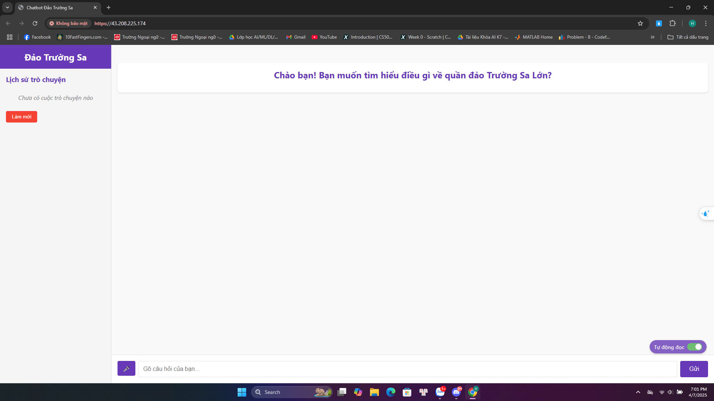

# Chatbot Đảo Trường Sa với RAG 🏝️
# Ảnh của website Chatbot

## Giới thiệu

Chatbot Đảo Trường Sa là một ứng dụng trí tuệ nhân tạo sử dụng kỹ thuật RAG (Retrieval Augmented Generation) để trả lời các câu hỏi về quần đảo Trường Sa của Việt Nam. Dự án này kết hợp giao diện web hiện đại với khả năng xử lý ngôn ngữ tự nhiên để cung cấp thông tin chính xác và đáng tin cậy.

## Tính năng nổi bật 🌟

- **RAG (Retrieval Augmented Generation)**
  - Tìm kiếm thông tin chính xác từ nguồn dữ liệu đáng tin cậy
  - Tổng hợp câu trả lời tự nhiên và mạch lạc
  - Cập nhật dữ liệu dễ dàng

- **Giao diện người dùng**
  - Thiết kế Material-UI hiện đại và responsive
  - Hỗ trợ dark/light mode
  - Hiển thị lịch sử chat
  - Gợi ý câu hỏi thông minh

- **Xử lý âm thanh**
  - Chuyển văn bản thành giọng nói (Text-to-Speech)
  - Nhận diện giọng nói (Speech-to-Text)
  - Điều chỉnh tốc độ phát âm

## Công nghệ sử dụng 🛠️

### Frontend
- **React.js** - Thư viện UI
- **Material-UI** - Framework CSS
- **Axios** - HTTP Client
- **Web Speech API** - Xử lý âm thanh

### Backend
- **Flask** - Web Framework
- **Flask-CORS** - Xử lý CORS
- **gTTS** - Google Text-to-Speech
- **SpeechRecognition** - Nhận diện giọng nói
- **RAG** - Retrieval Augmented Generation

## Cấu trúc dự án 📁

```
── backend/                      # Thư mục backend
│   ├── convert_embedding/        # Module xử lý embedding
│   ├── gen/                     # Module sinh dữ liệu
│   ├── input/                   # Dữ liệu đầu vào
│   ├── model/                   # Models
│   ├── read_file/              # Module đọc file
│   ├── semantic_search/        # Module tìm kiếm ngữ nghĩa
│   ├── templates/              # Templates
│   ├── app.py                  # API endpoints
│   ├── data.py                 # Xử lý dữ liệu
│   ├── dataset_tmp.csv         # Dataset tạm thời
│   ├── main.py                 # Entry point
│   ├── README.md              
│   ├── render.yaml            
│   ├── requirements.txt        # Dependencies Python
│   ├── start_backend.py       # Script khởi động backend
│   └── test.py                # Tests
├── frontend/                   # Thư mục frontend
│   ├── node_modules/          # Dependencies
│   ├── public/                # Assets công khai
│   ├── src/                   # Source code
│   ├── package-lock.json      
│   ├── package.json           # Dependencies Node.js
│   └── README.md
├── Train_Kmeans/              # Module training K-means
├── README.md                  # Tài liệu chính
├── package-lock.json
├── package.json               # Dependencies chính
├── pyproject.toml            # Cấu hình Python
├── start_complete_app.sh     # Script khởi động toàn bộ
├──truong_sa_qa_deduplicated.json # dataset
```

## Cài đặt và Chạy 🚀

1. **Clone dự án**
```bash
git clone https://github.com/PhamVanHung412004/Chatbot_GL2_version3.git
cd Chatbot_GL2_version3
```

2. **Cài đặt dependencies**
```bash
# Frontend
cd frontend
npm install

# Backend
cd backend
pip install -r requirements.txt
```

3. **Khởi động ứng dụng**
```bash
# Terminal 1 - Frontend
cd frontend
npm start

# Terminal 2 - Backend
cd backend
python app.py
```

## Cách hoạt động của RAG 🔄

### 1. Retrieval (Truy xuất)
- Dữ liệu về Trường Sa được lưu trữ có cấu trúc
- Khi nhận câu hỏi, hệ thống tìm kiếm thông tin liên quan
- Sử dụng từ khóa và ngữ cảnh để chọn nội dung phù hợp

### 2. Augmentation (Tăng cường)
- Thông tin được truy xuất được đưa vào ngữ cảnh
- Hệ thống phân tích và chọn lọc dữ liệu phù hợp
- Tối ưu hóa nội dung cho câu trả lời

### 3. Generation (Tạo câu trả lời)
- Tổng hợp câu trả lời từ dữ liệu đã chọn
- Đảm bảo câu trả lời mạch lạc và tự nhiên
- Tạo âm thanh từ văn bản nếu cần

## API Endpoints 📡

### Chat API
- `POST /api/chat`
  - Gửi câu hỏi và nhận câu trả lời
  - Hỗ trợ tạo file âm thanh

### Speech API
- `POST /api/speech-to-text`
  - Chuyển đổi âm thanh thành văn bản
  - Hỗ trợ nhiều định dạng âm thanh

### History API
- `GET /api/history`
  - Lấy lịch sử chat
- `POST /api/clear-history`
  - Xóa lịch sử chat

## Cấu hình môi trường 🔧

### Biến môi trường
```env
FLASK_ENV=development
FLASK_APP=app.py
REACT_APP_API_URL=http://localhost:5000
```

### Ý tưởng dùng RAG
```
Bước 1: Tôi lưu câu hỏi kèm theo câu trả lời dưới dạng dict trong python rồi lưu dưới dạng dict bạn có thể xem ở trong file truong_sa_qa_deduplicated.json
Bước 2:  Tôi đưa các câu hỏi vào vector embedding rồi lưu chúng vào vector database.
Bước 3: 1 câu hỏi của user tôi sẽ tìm trong vectordata nào gần với câu hỏi nhất rồi tôi tiến hành tra lại trong dict ở file json.
Bước 4: Từ những câu trả lời có liên quan tôi đưa nó vào mô hình sinh.Rồi đưa ra câu trả lời.     
```

## Tác giả ✨

**Phạm Văn Hùng**
- GitHub: [@PhamVanHung412004](https://github.com/PhamVanHung412004)

## Liên hệ 📬

Nếu bạn có bất kỳ câu hỏi hoặc góp ý, vui lòng:
- Tạo issue trong repository
- Liên hệ qua GitHub

---
Made with ❤️ by Phạm Văn Hùng
